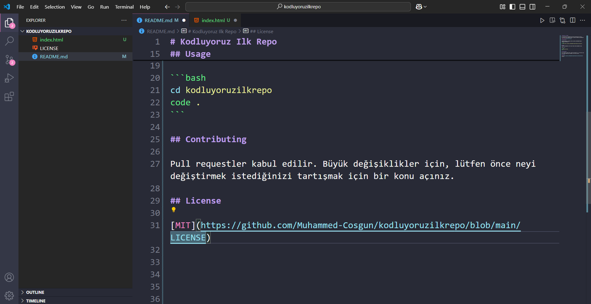

# Kodluyoruz Ilk Repo

Bu repo Kodluyoruz Front-End Eğitimi'nde oluşturduğumuz ilk repo. İçerisinde bir adet README dosyası, bir adet de index.html barındırıyor.



## Installation

Öncelikle projeyi clonelayın.(https://github.com/Muhammed-Cosgun/kodluyoruzilkrepo.git)

```bash
git clone https://github.com/Muhammed-Cosgun/kodluyoruzilkrepo.git 
```

## Usage
Projeyi cloneladıktan sonra Visual Studio Code programında açınız.

Linux için:

```bash
cd kodluyoruzilkrepo
code .
```

## Contributing

Pull requestler kabul edilir. Büyük değişiklikler için, lütfen önce neyi değiştirmek istediğinizi tartışmak için bir konu açınız.

## License

[MIT](https://github.com/Muhammed-Cosgun/kodluyoruzilkrepo/blob/main/LICENSE)


